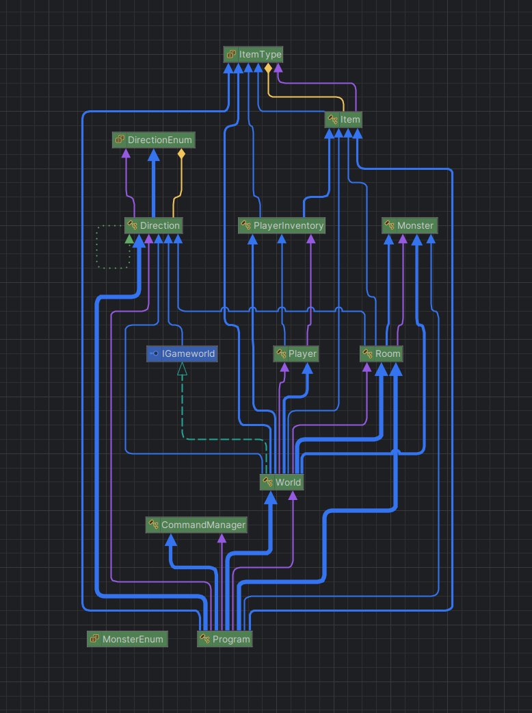

# Text-Based Adventure Game Documentation

Made by Sander De Moor, Nils Mertens, & Jonathan Maesen
---

## 1. World Structure

The game world is a dynamic environment constructed from a network of interconnected **`Room`** objects. This design allows for complex and expandable maps that players can explore.

#### 1.1 Rooms

A `Room` is the fundamental building block of the game world. Each room has the following characteristics:

- **Name and Description**: A title and descriptive text that informs the player about their surroundings.
- **Exits**: Connections to other rooms, defined by a `Direction` (*Up*, *Down*, *Left*, *Right*).
- **Items**: A room can contain one or more `Item` objects that the player can pick up.
- **Monster**: A room may be inhabited by a `Monster`.
- **Special Properties**:
  - `IsDeadly`: If `true`, entering the room results in immediate death.
  - `RequiresKey`: If `true`, the room is initially locked and requires a `Key` type item to enter.
- **Dynamic Descriptions**: Rooms can have alternate descriptions that are displayed under specific conditions:
  - `DescriptionWhenEmpty`: Shown after an item has been taken from the room.
  - `DescriptionWhenMonsterDefeated`: Shown after a monster in the room has been defeated.

#### 1.2 World Composition

The entire game world is instantiated in the `Program.cs` file within the `CreateTestWorld` method. This centralizes the world-building process and is responsible for:
1.  Instantiating all `Room` objects.
2.  Populating rooms with `Item` and `Monster` objects.
3.  Connecting the rooms by defining their `Exits`.
4.  Setting the player's starting room.

---

## 2. Game Mechanics

The game is played by typing commands into the console. The core game loop reads player input, executes the corresponding action, and updates the game state in real-time.

#### 2.1 Player Commands

| Command             | Description                                                   |
| ------------------- | ------------------------------------------------------------- |
| `go <direction>`    | Moves the player to the room in the specified direction.      |
| `take <item>`       | Adds an item from the current room to the player's inventory. |
| `look`              | Displays the description of the current room and inventory.   |
| `inventory`         | Shows only the items currently in the player's inventory.     |
| `fight`             | Initiates combat with a monster in the current room.          |
| `help`              | Lists all available commands.                                 |
| `quit`              | Exits the game.                                               |

#### 2.2 Combat

- Combat is initiated in one of two ways:
  1.  The player explicitly uses the `fight` command.
  2.  The player enters a room that contains a `Monster`.
- **Winning Combat**: If the player has a `Weapon` type item in their inventory, they will defeat the monster.
- **Losing Combat**: If the player does not have a weapon, they will die, and the game will be over.
- **Fleeing**: Attempting to leave a room while an undefeated monster is present also results in a game over.

#### 2.3 Winning and Losing

- **Win Condition**: The game is won by entering the **"Treasure Room,"** which requires a key for access.
- **Game Over Conditions**:
  1.  Entering a room where `IsDeadly` is `true`.
  2.  Engaging in combat with a monster without a `Weapon`.
  3.  Attempting to move out of a room while a monster is present.
- **Restart Mechanism**: Upon a "Game Over," the game automatically restarts after a short delay, creating a fresh world instance.

#### 2.4 Console Experience

- **Clear Interface**: The console clears after every command to provide a clean and focused view of the current game state.
- **Error Handling**: If an unknown command is entered, the game displays an error message and then redisplays the current room's description, so the player never loses context.

---

## 3. Class Overview

The project follows an object-oriented design, with each class having a distinct and well-defined responsibility.



- **`Program.cs`**: The main entry point of the application. It contains the primary game loop, handles command-line input, and initiates the game world.

- **`World.cs`**: The core of the game engine. It manages the game state, including the collection of all rooms and the player's current location. It implements the logic for all player actions.

- **`Room.cs`**: Defines a single location in the game. It holds its own description, exits, items, and an optional monster, and is responsible for generating its own descriptive text.

- **`Player.cs`**: Represents the player character, holding their `Inventory`.

- **`Monster.cs`**: Represents a hostile creature. It has a name and a status indicating whether it `IsAlive`.

- **`Item.cs`**: Defines an object that can be found and picked up. Items have a `Name`, `Description`, and `ItemType` (e.g., `Weapon`, `Key`).

- **`Inventory.cs`**: The `PlayerInventory` class manages the items the player is carrying and provides helper methods to check for specific item types.

- **`Direction.cs`**: Defines the possible directions of movement (*Up*, *Down*, *Left*, *Right*), ensuring type safety for room connections.

- **`console-interfacer.cs`**: Contains the `CommandManager`, a generic utility for registering and processing text-based commands. It handles parsing user input and dispatching it to the correct action.

---

## 4. How to Run the Game

This is a .NET console application. To start the game, navigate to the project's root directory in your terminal and run the following command:

```bash
dotnet run
```

---

## 5. Testing Approach

The project's primary focus is on robust testing to ensure code quality and correctness. Our testing strategy is divided into three layers:

#### 5.1 Unit Testing

Unit tests are used to validate individual components in isolation. We focused on testing the core logic of classes like `PlayerInventory`, `Room`, and `Item` to ensure their methods behave as expected. For example, we verified that `PlayerInventory.HasItemType()` correctly identifies items and that a `Room` correctly updates its description after a monster is defeated.

#### 5.2 Integration Testing

Integration tests check the collaboration between different classes. We created tests to simulate player actions and verify the entire game state updates correctly. A key test case was ensuring that moving between rooms (`Player` and `World` interaction) and picking up an item (`Player`, `Room`, and `Item` interaction) works seamlessly.

#### 5.3 Behavior-Driven Testing (BDD)

We used a BDD approach with Gherkin syntax to test end-to-end player scenarios. These tests describe a user's journey from a feature-level perspective, making them easy to understand for everyone. Our BDD tests cover the main win/loss conditions:
- **Winning the game**: A scenario where the player finds the key, defeats the monster, and reaches the treasure room.
- **Losing the game**: Scenarios for dying in a deadly room, fighting a monster without a weapon, or trying to flee from a monster.
